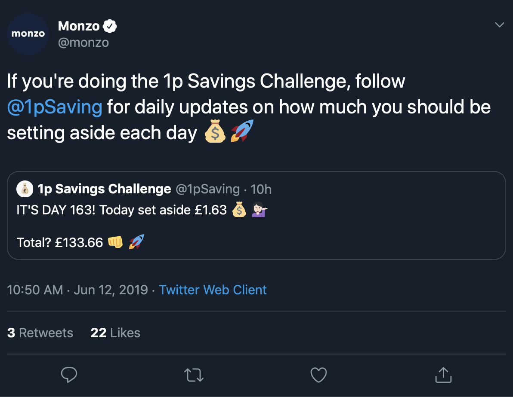
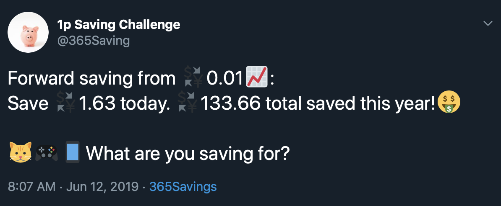

You know when you get that feeling you’re being watched 👀? Recently I’ve had the suspicion that a darling of the FinTech world, Monzo, has been…well, following me around. Why would one of these cool new challenger banks flush with £211M in crowdfunding and VC money, valued at a cool £2B want to stalk little old me?

Read on for a thrilling story of money, intrigue, and pointless pettiness\*

\* by me

Rewind. It began with [this blog post](https://monzo.com/blog/2019/06/04/reverse-1p-savings-challenge-monzo/) from them, a lovely little article on an easy way to save pennies a day, and before you know it you’ve saved £667.67, and look, you can entirely automate it thanks to their amazing integration with IFTTT.

IFTTT (If This Then That) is a way non developers can glue different web applications and web enabled things together. IFTTT is great for doing things like posting your instagram pics to Twitter, or turning on your internet enabled lights once you have walked 12357 steps. It’s geeky, weird, and amazing and Monzo, a bank, has IFTTT integration. This is incredible and one of the reasons I love them. I was so enamoured of this partnering that a year ago over a few evenings, I worked out the byzantine labyrinth that is the IFTTT developer platform, to write my own IFTTT Monzo applet. Hey, let’s look at the IFTTT screen shot on that blog post again.

Zoom. Enhance! Look! IT ME!

<video controls width="250">

    <source src="./zoomenhance.mov">

    Sorry, your browser doesn't support embedded videos.

</video>

WOW, they posted a link to my applet! How cool!

I know what you’re thinking. “Conrad, I think you’re reading a bit much into it. They just posted a link to a little IFTTT applet you wrote, so what?”

Maybe. Honestly I was quite excited, and also a little gutted they didn’t credit me a little more - just a link to my Twitter account or some kind of shout out. Just a little thing. Please? I’ve only got 200 followers, and they’ve got loads.

(Told you I was petty)

Anyway, my spidisense was tingling. Something was up, and 8 days later, I saw Monzo tweet this to their 91K followers:



(@1pSaving is a Monzo account btw)

“Wait a second!”, I hear you say, “by jove this looks like a very similar tweet to those sent out by the popular\* account @365Saving!”

\* not that popular

Let’s take a look shall we:



OK, well dunno what’s going on with the currency emoji (I’ve fixed that now), but yeah, I can see they’ve got the same vibe. I like the little piggy and the wide variety of cat, games console and phone savings suggestions. But so what?

Well reader, how’s this for a plot twist that I may have sign posted a bit in the previous paragraph…:

I WROTE THE @365SAVING bot! Yep, the mastermind behind the reverse 1p saving challenge IFTTT applet also wrote a twitter bot doing the same thing! And look closer, this bot is SMART. OK, not book smart, or street smart, or smart like a fancy dressed person. Not machine learning smart either.

OK now I can barely bring myself to call it a bot.

But loooook, adorable little piggy! Also, every day it works out the amount people should save, AND it automagically generates inspiring ideas for things they could be saving for in emoji form. Yesterday it suggested 🎅🏖🐶. The day before 🖥👒💍! Relevant. Actionable. Fun. Like me!

So WTAF. Monzo have copied my Twitter account. No warning, no “hey CJ just FYI we really like your twitter bot but your emoji usage is a little….much, so we’re gonna do our own”.

They couldn’t even claim ignorance. I told them about it when I first started it in 2018, and they replied with cheerful social media positivity. They follow the account. I’ve posted details in their forum!

So it’s settled. Monzo have used my stuff twice in 8 days and they’ll keep doing it till I’m dead, because if they don’t then I might eventually start my own bank which would be better than theirs and then I would win.

Or maybe because they just like the things I’ve done, whatever.

Anyway, I reached out to them about their latest transgression and they’ve been awesome (damn them they’re so nice) - they’ve credited me on their @1pChallenge account and we’re working together to make their bot smarter - and you can make one too!

More than that finally I’ve got some validation that some of the little hobby projects I tinker on are actually quite useful to people 🤓 I’m going to go back through my half finished, abandoned and never started ideas & projects with renewed optimism and vigour. And if Monzo come looking for any more of my stuff, I’ve got a good idea which one they’ll wrap their grubby little mitts round next…

And maybe there’s another thing I should learn from this. If I want Monzo (or any other massive company) to stop nicking my stuff, I’m going to have to do more than write a little bit of nifty code and stick a cute pig on it. Nifty code is just a feature. Nifty code isn’t defensible. It’s not a “moat” in tech parlance. Users can be a moat. Community. Content. Stuff that needs perseverance, repetition, graft, hustle etc. Annoyingly it can’t be automated. It’s almost the opposite of coding really.

How about you? Have you written something that got “adopted” by a bigger company? Did you get credited? How did you feel?

Piggy out 🐷

### boop
